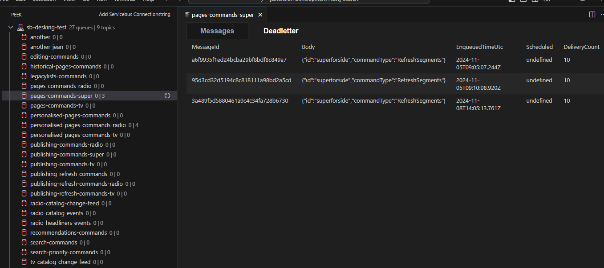
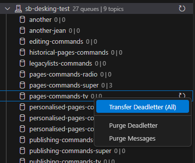

# PeekUI README

PeekUI is a tool for inspecting, resubmitting and purge messages on Azure Servicebus queues, topics and subscriptions. 

## Features

- View all Queues, Topics & Subscriptions for a given Service Bus
- Transfer from deadletter
- Purge messages

## Requirements

None.

## Extension Settings

None.

## Known Issues

None.

## Release Notes

### 0.0.3
- Fixed issue with opening subscriptions

### 0.0.2

- Fixed bug when re-opening closed webviews.
- Adjusted refresh state when transferring/purging messages
- Fixed possible infinite loop when transferring messages

### 0.0.1

Initial version of PeekUI
